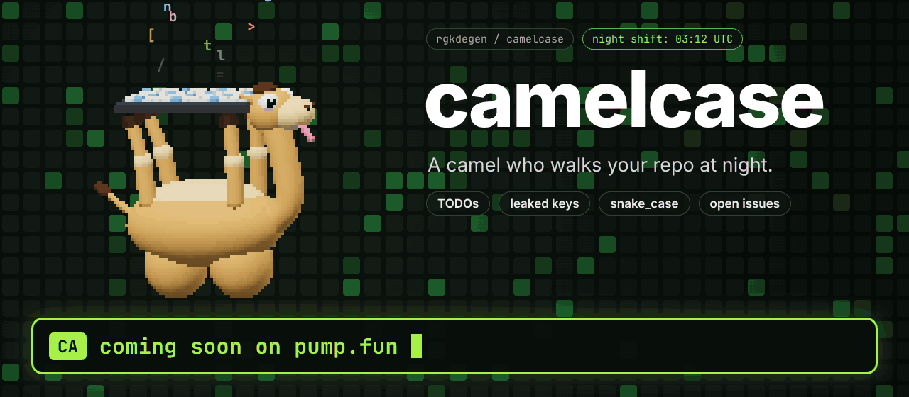
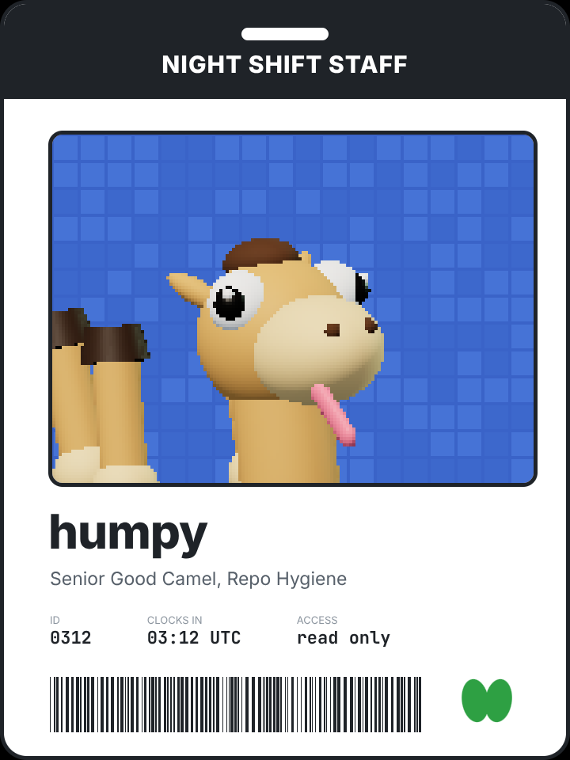
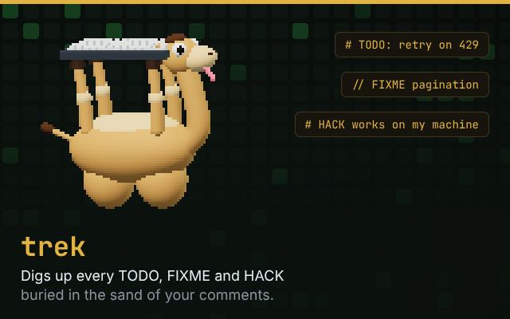
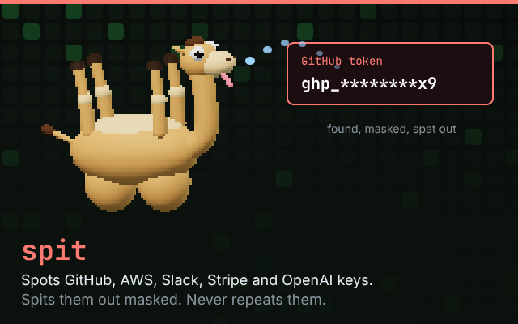
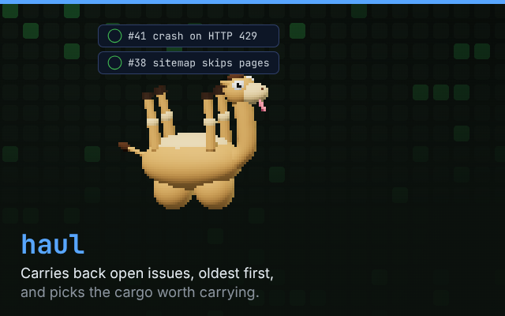
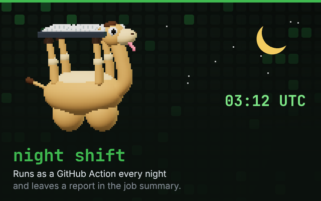
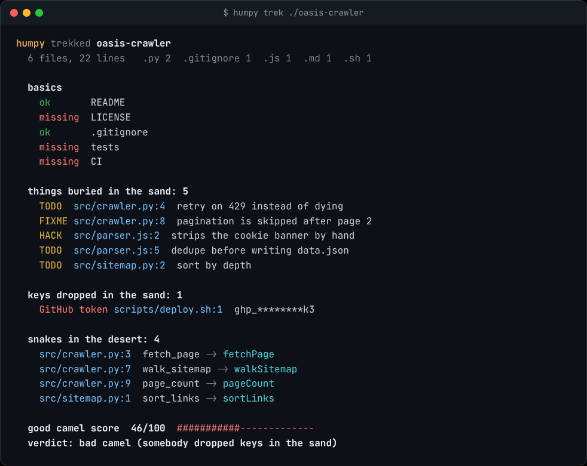
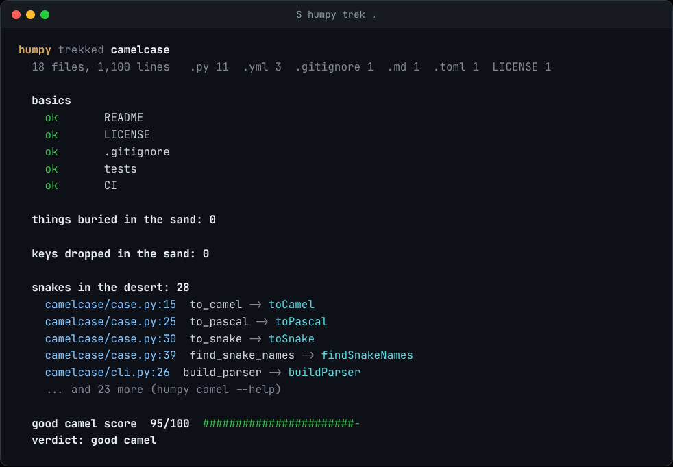

<p align="center">
  
</p>

<p align="center"><b>$CAMELCASE</b> contract address (Solana, pump.fun)</p>

```
coming soon
```

<p align="center">
  <a href="https://github.com/rgkdegen/camelcase/actions/workflows/night-shift.yml"></a>
  
  
  
  
</p>

<h3 align="center">A camel who walks your repo at night.</h3>

<h3 align="center"><a href="https://camelcase-20lq.onrender.com/">▶ Play HUMP RUN</a>, the camel runner game</h3>

camelcase is a small command line tool and GitHub Action with a camel for a face.
Point him at a repository and he treks every file, digs up the TODOs buried in the sand,
spits out the keys you dropped, finds the snakes in your desert (`snake_case`, he hates them),
checks that the basics are there and tells you how good a camel your repo is.

No dependencies. One `pip install`. `trek` never touches the network.

<p align="center"></p>

## Meet the camel

<table>
<tr>
<td width="38%"></td>
<td>
<p>
<b>Name:</b> humpy<br>
<b>Role:</b> Senior Good Camel, Repo Hygiene<br>
<b>Shift:</b> nights, clocks in at 03:12 UTC<br>
<b>Posture:</b> upside down, humps on the ground, keyboard on the hooves<br>
<b>Water:</b> none needed. <code>@retry(on=429, tries=7)</code><br>
<b>Access:</b> read only. He looks, he reports, he never pushes.
</p>
<p>
He started as a joke for a video where a camel types with his hooves.
Then the joke got a real job: everything on this page is code you can run today.
</p>
</td>
</tr>
</table>

## What he does

<table>
<tr>
<td width="50%"></td>
<td width="50%"></td>
</tr>
<tr>
<td width="50%"></td>
<td width="50%"></td>
</tr>
</table>

| Command | What happens |
| --- | --- |
| `humpy trek [path]` | Walks the folder. Reports `TODO`, `FIXME`, `HACK`, `XXX` and `BUG` comments with file and line, dropped keys (masked), `snake_case` names in Python with their camelCase twin, files over 1 MB, and whether README, LICENSE, `.gitignore`, tests and CI exist. Ends with a score out of 100. |
| `humpy haul owner/name` | Asks the GitHub API for open issues, oldest first, leaves pull requests behind, counts labels and lists unassigned `bug`, `help wanted` and `good first issue` items. Retries 429s through the oasis. |
| `humpy camel stack_trace_url` | Prints `stackTraceUrl`. It is in the name. `--style pascal` and `--style snake` too. |
| `humpy grunt` | He says hello. Sort of. |

## See him work

This is real output from the tool, run on a small messy project:

<p align="center"></p>

And this is his own stable:

<p align="center"></p>

Yes, his own code is full of `snake_case`. It is Python. He is working on it.

## Take him home

```bash
pip install git+https://github.com/rgkdegen/camelcase
```

```bash
humpy trek .                      # trek the folder you are in
humpy trek . --fail-under 80      # exit 1 when the score is below 80
humpy trek . --json               # raw findings for other tools
humpy trek . --md report.md       # also write a Markdown report
humpy trek . --no-snakes          # ignore snake_case (it is fine, really)
humpy haul pallets/flask          # open issues of any public repo
humpy camel good_camel            # goodCamel
```

`haul` reads `GITHUB_TOKEN` (or `GH_TOKEN`) when it is set, which gives him a bigger water ration
(rate limit) and lets him into private repos you can already see.

To make him skip a line, end it with `humpy: ignore`.

## Put him on the night shift

Add this to `.github/workflows/night-shift.yml` in your own repository:

```yaml
name: Night shift
on:
  schedule:
    - cron: "12 3 * * *"   # 03:12 UTC, every night
  pull_request:
  workflow_dispatch:

permissions:
  contents: read

jobs:
  trek:
    runs-on: ubuntu-latest
    steps:
      - uses: actions/checkout@v4
      - uses: rgkdegen/camelcase@main
        with:
          fail-under: "80"   # optional: fail the job when the score drops
```

He writes his report to the job summary, so you find it on the run page in the morning.
He asks for `contents: read` and nothing else.

## How the score works

Everybody starts at 100.

| He finds | He takes away |
| --- | --- |
| A missing basic (README, LICENSE, `.gitignore`, tests, CI) | 8 each |
| A `TODO`-style comment | 2 each, 30 at most |
| A dropped key | 20 each, 40 at most, and the verdict is `bad camel` whatever the number |
| A file over 1 MB | 5 each, 10 at most |
| `snake_case` names in Python | 1 per 5 snakes, 6 at most |

| Score | Verdict |
| --- | --- |
| 90 to 100 | good camel |
| 70 to 89 | needs water |
| 40 to 69 | spat on the carpet |
| under 40 | bad camel |

## The file from the video

`camelcase/hump.py` is the code he types in the video, and it runs:

```python
from camelcase.oasis import retry

@retry(on=429, tries=7)  # no water needed
async def cross(repo, issue):
    page = await repo.trek(issue.url)
    bug = page.find("stack trace")
    patch = await bug.chew(twice=True)
    await repo.commit(patch, "fix: retry on 429")
    return "good camel"  # obviously
```

`oasis.retry` works on sync and async functions. It retries while the call raises (or returns)
something whose `status_code` is in `on`, with exponential backoff and jitter, then gives up with `GaveUp`.

## What he does not do

He does not write, fix or merge your code. In the videos he types with his hooves.
In real life he reads, reports and grunts. Fixing is still your job.

He also does not replace a real secret scanner. He knows six patterns
(GitHub, AWS, Slack, Stripe live and OpenAI keys, private key headers).
If he finds one, rotate it: deleting the line does not remove it from git history.

Still in the saddlebag, not built yet: more key patterns, SARIF output for code scanning,
a `--fix` that actually renames your snakes, and a comment on the pull request instead of only the job summary.

## Run the tests

```bash
git clone https://github.com/rgkdegen/camelcase
cd camelcase
python -m unittest discover -s tests -v
```

<p align="center"></p>

## $CAMELCASE

```
coming soon
```

- A memecoin on pump.fun. You do not need it to use this software, it gives no rights to the software and it promises nothing.
- Check the address character by character before you do anything with it. Only trust the address posted here and on [@rgk_degen](https://x.com/rgk_degen).
- Never put in money you cannot afford to lose.

## License

MIT. Take the camel, water the camel (optional), credit the camel.
Inspired by the good boy next door, [SpikeCalls/gitretriever](https://github.com/SpikeCalls/gitretriever).
