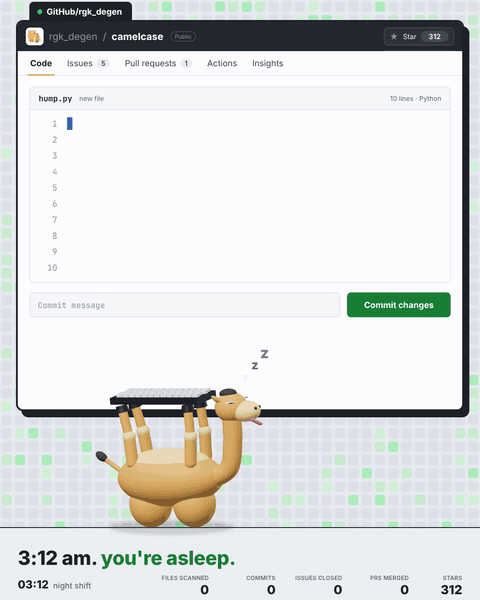
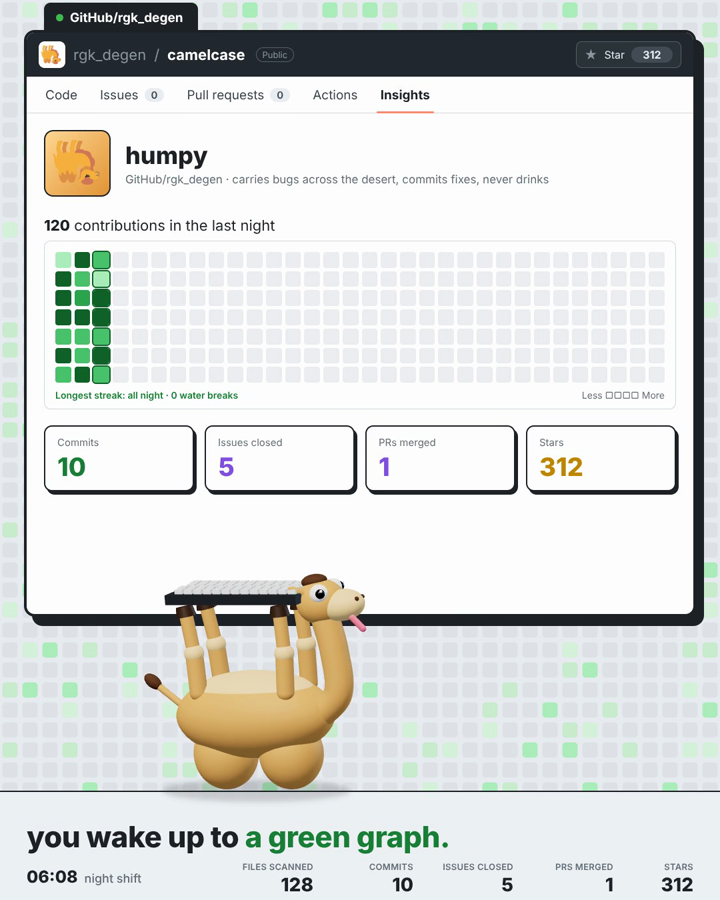

<div align="center">

# 🐫 camelcase

**3:12 am. you're asleep. your camel opens the repo.**



`humpy` is a night-shift camel for your repo.<br>
he walks every file, sniffs out every `TODO`, spits on typos, camelCases your snake_case,<br>
retries your 429s seven times (no water needed) and leaves you a green graph by morning.

[](.github/workflows/ci.yml)


</div>

---

## what humpy does all night

| time  | humpy | command |
|-------|-------|---------|
| 03:12 | you're asleep. he opens the repo. | |
| 03:44 | types with his hooves | `humpy camel stack_trace_url` |
| 04:24 | scans the whole repo | `humpy scan` |
| 04:45 | spits on every open issue | `humpy spit` |
| 05:36 | opens a PR. checks go green. | `pytest` · `ruff` · CI |
| 06:26 | you wake up to a green graph. | `humpy graph` |

## install

```bash
git clone https://github.com/rgkdegen/camelcase && cd camelcase
pip install -e .
humpy --version
```

zero dependencies. python 3.9+. runs anywhere a camel can walk.

## usage

```bash
humpy scan .            # walk the repo: files, lines, TODO/FIXME/BUG/HACK, typos, snake_case
humpy spit .            # list every open issue humpy would spit on
humpy camel good_camel  # -> goodCamel   (--style pascal | snake)
humpy lint src/         # flag snake_case names in .py files, exit 1 if any (CI-friendly)
humpy graph .           # contribution graph of the last 24h of git commits
```

```text
      |  |    |  |
      |  |    |  |    .-.
    .-'--'----'--'-.  ( o>     humpy v0.1.0
   (                )_/ /      night shift: 03:26
    `-.  .-''-.  .-'  /        "i chew twice."
       (    )(    )
        `--'  `--'

  scanning · 11 files · 599 lines

  src/camelcase/cli.py       camelcase
  src/camelcase/hump.py      clean ✓
  ...
  FILES SCANNED 11   ISSUES 0   TYPOS 0   SNAKE_CASE 22
```

Lines with `humpy: ignore` are skipped. `.git`, `node_modules`, `venv` and friends are skipped too — even camels have limits.

## the file from the video

Yes, `hump.py` is real and it runs:

```python
from camelcase.oasis import retry

@retry(on=429, tries=7)  # no water needed
async def cross(repo, issue):
    page = await repo.trek(issue.url)
    bug = page.find("stack trace")
    patch = await bug.chew(twice=True)
    await repo.commit(patch, "fix: retry on 429")
    return "good camel"  # obviously
```

`oasis.retry` works on sync and async functions. It retries when the call raises an exception with a
`status_code` (or `response.status_code`) in `on`, or returns a response with that status. Exponential
backoff with jitter, then `GaveUp` after the last try.

```python
import httpx
from camelcase import retry

@retry(on=[429, 503], tries=7)
async def get(url):
    async with httpx.AsyncClient() as c:
        return await c.get(url)
```

## FAQ

**why is the camel upside down?**
he runs on his humps. it's more efficient. don't ask.

**does he really type with his hooves?**


**why camelCase?**
it's literally in the name.

**what's in the humps?**
not water. 65 commits.



## contributing

open an issue. humpy will spit on it (lovingly). PRs welcome — CI runs build, tests on 3.9/3.11/3.13 and lint (no sand in the gears).

```bash
pip install -e ".[dev]"
pytest -q && ruff check .
```

## license

MIT © [@rgk_degen](https://x.com/rgk_degen). no camels were harmed.
